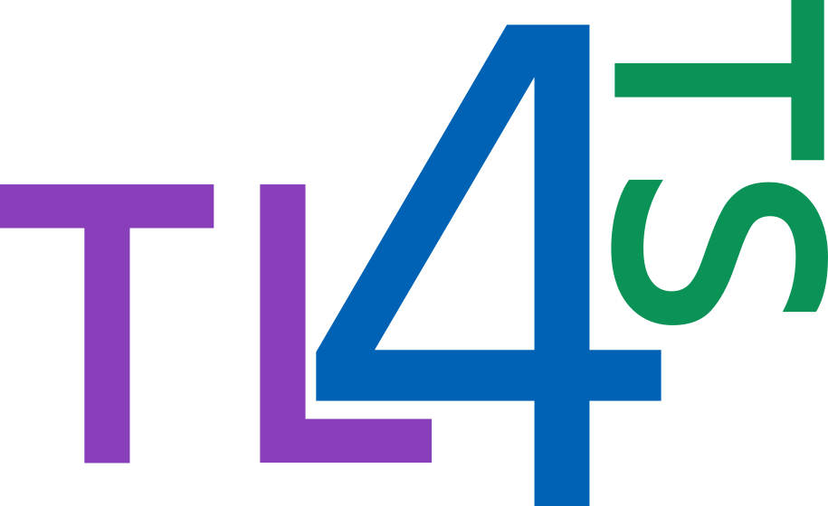

#  Unsupervised Domain Adaptation for Time Series Classification

This repository contains the official implementation of the benchmark titled "Deep Unsupervised Domain Adaptation for Time Series Classification: a Benchmark" available on [ArXiv](https://arxiv.org/abs/2312.09857).
 
This work was conducted by the  team at Ericsson Research in France as part of the open source initiative.


*Average rank diagrams, using accuracy on all tested algorithms and hyperparameter tuning methods. The different colors specify the employed hyperparameter tuning method: green for <span style="color:lightgreen">IWCV</span>, blue for <span style="color:deepskyblue">Source Risk</span> and red for <span style="color:red">Target Risk</span>.*

## Contributions 

We welcome contributions to our benchmark. 

For contributing, please follow the [https://github.com/EricssonResearch/UDA-4-TSC/blob/main/contribution.md](`contribution.md`) guide.

## Requirements

Make sure you have an env with `python==3.10` and run the following: 

```
pip install -r requirements.txt 
```

## Run

Make sure you are inside `src/`, then to run a short pipeline of `CoDATS` model on `har` dataset with `source=12` and `target=16` follow the two commands:

### Generate the config with hydra

```
python3 -m _utils.generate_conf 'stages/preprocess=har' 'stages/train=CoDATS' 'utils.idxExperiment=1' 'stages.tune.tuner_config.address=null' 'stages.tune.ray_config.resume=false' 'stages.tune.ray_config.num_samples=1' 'global.train_time_limit=15' 'global.tune_time_limit=30' '++stages.tune.tuner_config.hyperparam_fixed.device=cpu' 'stages.tune.ray_config.resources_per_trial.gpu=0'
```

### Run the pipeline 

```
bash run.sh
```

### View result 

```
cat output/results/dataset_name\=har/source\=12/target\=16/classifier_name\=CoDATS/metrics.json
```

### Docker

To build the docker image: 

```
docker build -t uda-4-tsc:latest .
```

To run the docker image:

```
docker run --name uda-4-tsc --network host --entrypoint bash -idt -v /path/to/cloned/uda-4-tsc:/tmp  uda-4-tsc:latest
```

Now you have the necessary env to run the code.

Alternatively you can use the already published docker image on docker hub:  TODO

## Results

The full results of this benchmark are available at [`results/`](/results/).

## Reference

If you re-use this work, please cite:

```
@misc{uda4tsc,
      title={Deep Unsupervised Domain Adaptation for Time Series Classification: a Benchmark}, 
      author={Ismail Fawaz, Hassan and Del Grosso, Ganesh and Kerdoncuff, Tanguy and Boisbunon, Aurelie and Saffar, Illyyne},
      year={2023},
      eprint={2312.09857},
      archivePrefix={arXiv},
      primaryClass={cs.LG}
}
```

## Acknowledgement

We would like to express our sincere gratitude to all individuals managing the AILAB Server within the Ericsson Re-
search department. Their support and assistance have been invaluable for the completion of this research experiments.

A special acknowledgment is extended to Laetitia Chapel, Charlotte Pelletier and Romain Tavenard from the IRISA research institute, for their collaborative spirit and the resources they shared with us. Furthermore, we deeply appreciate their critical review and constructive feedback on earlier drafts of our work, which significantly enhanced the clarity and coherence of our findings.

## License

This work is distributed under the [BSD 3-Clause License](https://opensource.org/license/bsd-3-clause/).
